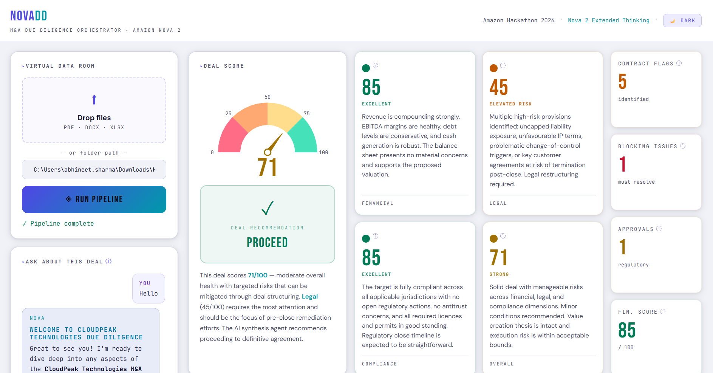

<div align="center">


# DealLens | VDR Intelligence

**Automated M&A Due Diligence · Powered by Amazon Nova 2 with Extended Thinking**

[](https://python.org)
[](https://fastapi.tiangolo.com)
[](https://aws.amazon.com/bedrock/)
[](https://langchain-ai.github.io/langgraph/)
[](LICENSE)

</div>

---

## Overview

M&A due diligence is slow, expensive, and bottlenecked by human bandwidth. DealLens eliminates that bottleneck.

Drop in your Virtual Data Room documents — financials, contracts, compliance filings — and a 4-agent AI pipeline powered by **Amazon Nova 2 with Extended Thinking** tears through them in minutes. You get a structured breakdown across financial health, legal red flags, and compliance risk, collapsed into a single weighted deal score with a go/no-go recommendation and full risk matrix.

Built end-to-end for the **Amazon Nova AI Hackathon 2026**.

---

## Demo



---

## How It Works

```
VDR Documents  (PDF / DOCX / XLSX)
      │
      ├──▶  Node 1 · Financial Analysis       [Nova 2 + Extended Thinking]
      ├──▶  Node 2 · Contract Red Flags       [Nova 2 + Extended Thinking]
      ├──▶  Node 3 · Compliance Issues        [Nova 2 + Extended Thinking]
      │
      └──▶  Node 4 · Synthesis & Scoring      [Nova 2 + Extended Thinking]
                  │
                  └──▶  Deal Score · Risk Matrix · Recommendation · NOVA Chat
```

**Scoring weights:** Financial × 0.40 · Legal × 0.35 · Compliance × 0.25

| Score | Recommendation |
|-------|----------------|
| ≥ 70 | Proceed |
| 45 – 69 | Proceed with Conditions |
| < 45 | Do Not Proceed |

Results are cached via **SHA-256 → ChromaDB**. Re-running the same document set returns instantly.

---

## Stack

| Layer | Technology |
|-------|-----------|
| AI Models | Amazon Nova 2 (Extended Thinking) via Amazon Bedrock |
| Orchestration | LangGraph |
| Backend | FastAPI + Pydantic v2 |
| Frontend | Dash + Plotly + Bootstrap |
| Cache | ChromaDB |
| Document Parsing | PyMuPDF · python-docx · openpyxl |
| Config | pydantic-settings |

---

## Project Structure

```
vdr_intelligence/
├── api/                        # FastAPI backend  (port 8000)
│   ├── main.py
│   ├── dependencies.py
│   └── routes/
│       ├── upload.py           # POST /api/v1/upload
│       ├── diligence.py        # POST /api/v1/diligence/run
│       └── chat.py             # POST /api/v1/diligence/{doc_id}/chat
├── pipeline/                   # LangGraph 4-node pipeline
│   ├── graph.py
│   ├── nova.py                 # Bedrock invoke + json-repair
│   ├── cache.py                # ChromaDB result cache
│   └── nodes/
│       ├── financial.py
│       ├── contract.py
│       ├── compliance.py
│       └── synthesis.py
├── ingestion/
│   └── extractor.py            # PDF / DOCX / XLSX text extraction
├── models/
│   └── schemas.py              # Pydantic v2 models
├── frontend/                   # Dash frontend  (port 8050)
│   ├── app.py
│   ├── api_client.py
│   ├── theme.py
│   ├── charts.py
│   ├── layout.py
│   └── callbacks/
│       ├── pipeline.py
│       ├── chat.py
│       └── toggle.py
└── config.py                   # pydantic-settings, reads .env
```

---

## Setup

**Requirements:** Python 3.11 · AWS account · Amazon Bedrock access · Nova 2 enabled in `us-east-1`

**1. Clone**

```powershell
git clone https://github.com/divergent99/VDR-Intelligence.git
cd VDR-Intelligence
py -3.11 -m venv .venv
.venv\Scripts\Activate
pip install -r requirements.txt
```

**2. Configure**

```powershell
cp .env.example .env
```

```env
AWS_ACCESS_KEY_ID=your_key
AWS_SECRET_ACCESS_KEY=your_secret
AWS_REGION=us-east-1
NOVA_MODEL_ID=us.amazon.nova-2-lite-v1:0
```

**3. Run**

```powershell
# Terminal 1 — backend
uvicorn api.main:app --reload --port 8000

# Terminal 2 — frontend
python -m frontend.app
```

Open **http://localhost:8050** · API docs at **http://localhost:8000/docs**

---

## API Reference

| Method | Endpoint | Description |
|--------|----------|-------------|
| `POST` | `/api/v1/upload` | Upload files, returns extracted text + doc_id |
| `POST` | `/api/v1/diligence/run` | Run full pipeline, returns DiligenceResult |
| `GET` | `/api/v1/diligence/{doc_id}` | Fetch cached result |
| `GET` | `/api/v1/diligence/{doc_id}/dashboard` | Flat chart-ready payload |
| `POST` | `/api/v1/diligence/{doc_id}/chat` | Chat with NOVA about the deal |

---

## Configuration

| Variable | Default | Description |
|----------|---------|-------------|
| `AWS_ACCESS_KEY_ID` | — | AWS credentials |
| `AWS_SECRET_ACCESS_KEY` | — | AWS credentials |
| `AWS_REGION` | `us-east-1` | Bedrock region |
| `NOVA_MODEL_ID` | `us.amazon.nova-2-lite-v1:0` | Nova model string |
| `NOVA_MAX_TOKENS` | `4096` | Max tokens per node call |
| `NOVA_THINKING_MAX_TOKENS` | `10000` | Extended thinking budget |
| `NOVA_THINKING_EFFORT` | `medium` | `low` / `medium` / `high` |
| `DOC_CHAR_LIMIT` | `40000` | Max chars ingested from VDR |
| `NODE_CHAR_LIMIT` | `8000` | Max chars per node prompt |
| `CACHE_ENABLED` | `true` | Toggle ChromaDB cache |
| `CHROMA_PATH` | `./vdr_cache` | Cache storage path |

---

<div align="center">

Built by [Abhineet Sharma](https://github.com/divergent99) · Amazon Nova Hackathon 2026

</div>
